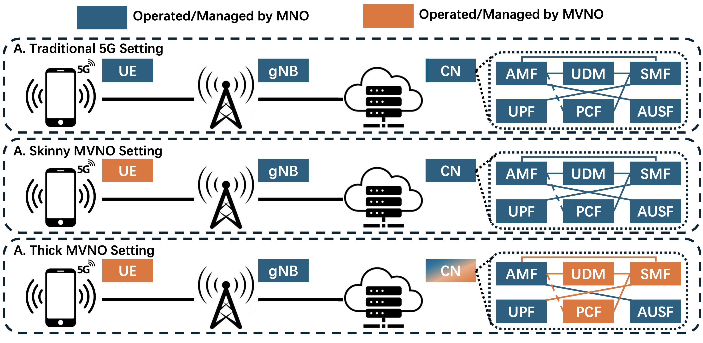

# PGUS: Pretty Good User Security for Thick MVNOs with a Novel Sanitizable Blind Signature

Yang Yang $^1$, Quan Shi $^1$, Prosanta Gope $^2$, Behzad Abdolmalek $^2$, Biplab Sikdar $^1$.

$^1$ National University of Singapore, $^2$ The University of Sheffield.



<div align="center">

###  [Paper Link](https://www.computer.org/csdl/proceedings-article/sp/2025/223600b102/26hiU7onwQ0) |  [Google Scholar](https://scholar.google.com/citations?view_op=view_citation&hl=en&user=FKOkibgAAAAJ&citation_for_view=FKOkibgAAAAJ:IjCSPb-OGe4C) | [Bibtex](#bibtex) 

</div>


<div align="justify">

## Abstract
<!-- **Abstract** -->

The rise of 5G technology has highlighted the critical role of Thick Mobile Virtual Network Operators (MVNOs) in providing customized mobile services. However, security and privacy challenges specific to Thick MVNOs remain inadequately addressed. In this paper, we present PGUS (Pretty Good User Security) for Thick MVNOs. Our proposed PGUS framework introduces a new cryptographic primitive called the Sanitizable Blind Signature (SBS), along with a novel Authentication and Key Agreement protocol named PGUS-AKA. Additionally, we have developed a seamless handover protocol, PGUS-HO, which is designed to secure all communication within a Thick MVNO environment. Furthermore, we conduct a thorough formal security analysis within the Universal Composability (UC) framework to address key threats, providing a strong solution for securing next-generation mobile networks. We also provide the evaluations on a 5G testbed which demonstrate the effectiveness of PGUS.  
</div>


## PGUS Experiment on OpenAirInterface


Please read and check the full instructions about OpenAirInterface(OAI) as described here:
[OAI](https://gitlab.eurecom.fr/oai/openairinterface5g).


### Minimum hardware requirements:
- Laptop/Desktop/Server for OAI CN5G and OAI gNB
    - Operating System: [Ubuntu 24.04 LTS](https://releases.ubuntu.com/24.04/ubuntu-24.04.1-desktop-amd64.iso)
    - CPU: 8 cores x86_64 @ 3.5 GHz
    - RAM: 32 GB
- Laptop for UE
    - Operating System: Microsoft Windows 10 x64
    - CPU: 4 cores x86_64
    - RAM: 8 GB
    - Windows driver for Quectel MUST be equal or higher than version **2.4.6**
- [USRP B210](https://www.ettus.com/all-products/ub210-kit/), [USRP N300](https://www.ettus.com/all-products/USRP-N300/) or [USRP X300](https://www.ettus.com/all-products/x300-kit/)
    - Please identify the network interface(s) on which the USRP is connected and update the gNB configuration file
- Quectel RM500Q
    - Module, M.2 to USB adapter, antennas and SIM card
    - Firmware version of Quectel MUST be equal or higher than **RM500QGLABR11A06M4G**

Please note that in this paper, the experiments is based on the [USRP B210](https://www.ettus.com/all-products/ub210-kit/).

### PGUS-AKA

#### Build OAI gNB and OAI nrUE

```bash
cd ~/openairinterface5g/cmake_targets
./build_oai -w USRP --ninja --nrUE --gNB --build-lib "nrscope" -C
```

#### Run OAI CN5G

```bash
cd ~/oai-cn5g
docker compose up -d
```

#### Run OAI gNB on USRP B210
```bash
cd ~/openairinterface5g/cmake_targets/ran_build/build
sudo ./nr-softmodem -O ../../../targets/PROJECTS/GENERIC-NR-5GC/CONF/gnb.sa.band78.fr1.106PRB.usrpb210.conf --gNBs.[0].min_rxtxtime 6 -E --continuous-tx
```


### PGUS-HO

#### Build gNB and UE with telnet support

```bash
cd ~/openairinterface5g/cmake_targets
./build_oai --ninja --nrUE --gNB --build-lib telnetsrv
```

#### Run OAI CN5G

```bash
cd ~/oai-cn5g
docker compose up -d
```

#### Start the CU including telnet support:
```bash
cd ~/openairinterface5g/cmake_targets/ran_build/build
sudo ./nr-softmodem -O ../../../targets/PROJECTS/GENERIC-NR-5GC/CONF/gnb-cu.sa.f1.conf --telnetsrv --telnetsrv.shrmod ci
```

#### Start the DU0:
```bash
cd ~/openairinterface5g/cmake_targets/ran_build/build
sudo ./nr-softmodem --rfsim -O ../../../targets/PROJECTS/GENERIC-NR-5GC/CONF/gnb-du.sa.band78.106prb.rfsim.pci0.conf --rfsimulator.serveraddr 127.0.0.1
```

#### Start the UE:
```bash
cd ~/openairinterface5g/cmake_targets/ran_build/build
sudo ./nr-uesoftmodem -C 3450720000 -r 106 --numerology 1 --ssb 516 --uicc0.imsi 001010000000001 --rfsim --rfsimulator.serveraddr server
```

#### After the UE is connected, start the DU1:
```bash
cd ~/openairinterface5g/cmake_targets/ran_build/build
sudo ./nr-softmodem --rfsim -O ../../../targets/PROJECTS/GENERIC-NR-5GC/CONF/gnb-du.sa.band78.106prb.rfsim.pci1.conf --rfsimulator.serveraddr 127.0.0.1
```

#### Once DU 1 is online, handover can be trigger by issuing this command:
```bash
echo ci trigger_f1_ho | nc 127.0.0.1 9090 && echo
```


<a name="bibtex"></a>
## Citation

If you find our work or any of our materials useful, please cite our papers:
```

@inproceedings{yang2025pgus,
  title={PGUS: Pretty Good User Security for Thick MVNOs with a Novel Sanitizable Blind Signature},
  author={Yang, Yang and Shi, Quan and Gope, Prosanta and Abdolmaleki, Behzad and Sikdar, Biplab},
  booktitle={2025 IEEE Symposium on Security and Privacy (SP)},
  pages={1102--1120},
  year={2025},
  organization={IEEE Computer Society}
}

```


## Acknowledgements

We thank [OpenAirInterface](https://openairinterface.org/) developers for making their tools publicly available. Our code modifies these tools to implement our protocol.  


